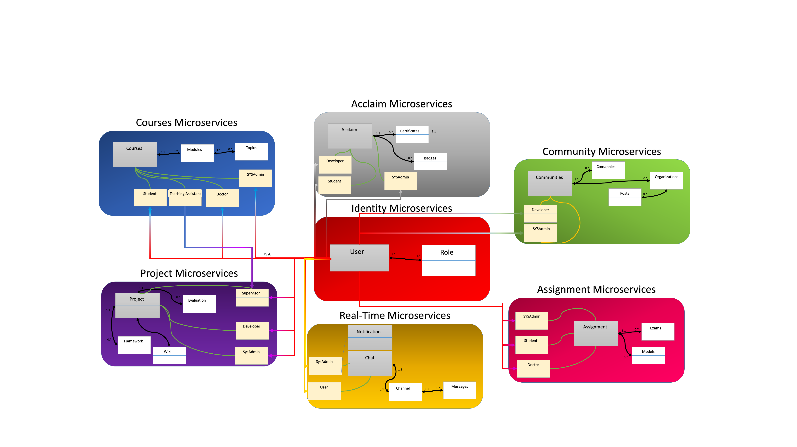

# In The Name of Allah 
---
# Abstract 
The Project is an application and architecture of how to use the Microservices Architecture to build an Interactive Learning services for students of practical faculties to optimize the performance, applying different design patterns that can integrate any type of services or platforms or programming languages, this architecture is composed of internal and external services as components or small projects that interact with each other. the business vision of the project takes the student into a lifecycle of 4 levels __(Skills Building – Entertainment - Interaction – Career development)__ using Internal services like project, course, schedule, tasks, games and assignment management; and external services like communities, teams, companies, training centers, market places and integration by the business using new methods of interaction like evaluation, chatting, blogging and cv development using standards, the conceptual model show these interactions of Microservices illustrated in following figure.

## © Ahmed Khalil __Mansoura University__ 2019/2020
