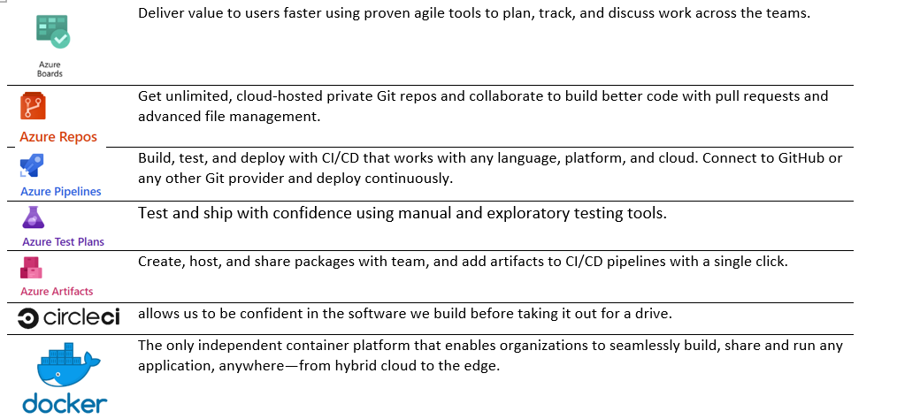

# In The Name of Allah 
---
# BACKGROUND OF TAVSSONCONTAINERS

- The Traditional Monolithic systems have __not__ the ability to sustain the learning systems and they don’t scalable enough to integrate new methodologies of learning from the external environments. Accepting the Microservice architecture and the Agile process to these environments make a new life for solving all the problems.

- Imagine that the faculty need to __adapt a new service__, with different development architecture and different programming languages, the traditional systems can’t handle it, but the Microservice have this ability to merge and conquer all other systems; make the process of development very easy by divide the development teams to SCRUMS.
 
- This system can make the faculties happy places to learn and develop and joy by integrate many interactive systems from everywhere and anytime, Make the development of Agile techniques 37% faster.
- Microservices must be implemented using Agile Process because it’s an Incremental Environment
    - Applying the Agile SCRUM framework as a core of development processes.

    - Using the Product Backlog and divide it to many sprints Backlogs for Incremental working.
    - Every Backlog contain a Coarse-grained service Analysis such as user stories
    - Packing every delivery of the project directly to the release process for deployment.
    - Making Azure DEVOPS the platform of managing the development process.
- Using DEVOPS plans and tools to manage configuration and control quality 

- Using the .Net Core for Microservices Environment as a lightweight server running on docker containers.
-	Using Angular for web platform and Android vs IOS for phone platform.
- Using __RabbitMQ__ as the service bus to serve events.
- Using __SQL Server and MongoDB__ for databasing using single database per service design pattern
- Using __OCELOT middleware__ for implementing API Gateway Design Patterns.

