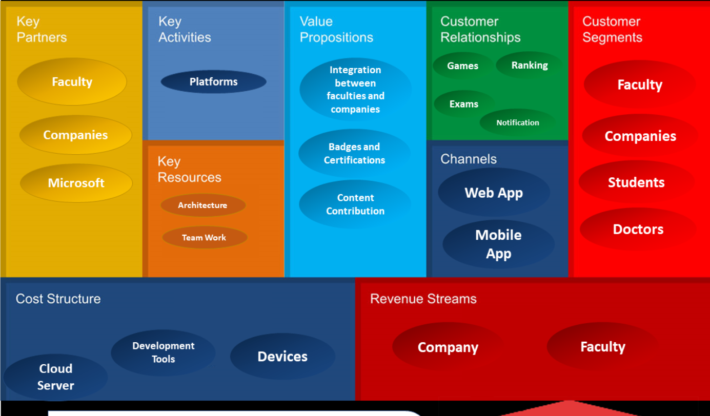

# In The Name of Allah
---
# Business Model / System Cost
## Faculty / MARKET RISK FACTORS 
 
 
- \- Time 
-  \+ Budget consuming for marketing project to the companies 
- \- Building apps in faculty IT infrastructure - Feedback over many releases 
 
 
 
 
 
 
 
## BUDGETARY RISK FACTORS 
 
- Azure cloud, deployment, and domain name hosting 
- Training Team, devops, github, trello, and many management tools 
- Licensed Software employed and Hardware compatibility 

## Business Model 

## © Ahmed Khalil __Mansoura University__ 2019/2020