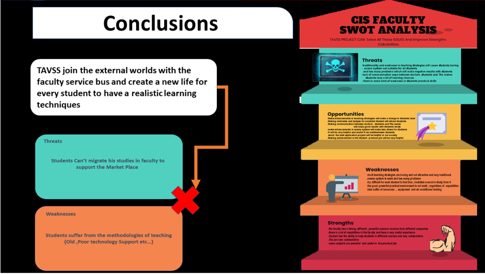

# In The Name Of Allah
---
# Conclusions Markdown
---
## SWOT Analysis vs Problem Solving 
- Weeknesses => Students Suffers from Traditional Methods of Teaching 
- Threats => Students Can't migrate his faculty's studies with the external working needs.
 

## © Ahmed Khalil __Mansoura University__ 2019/2020