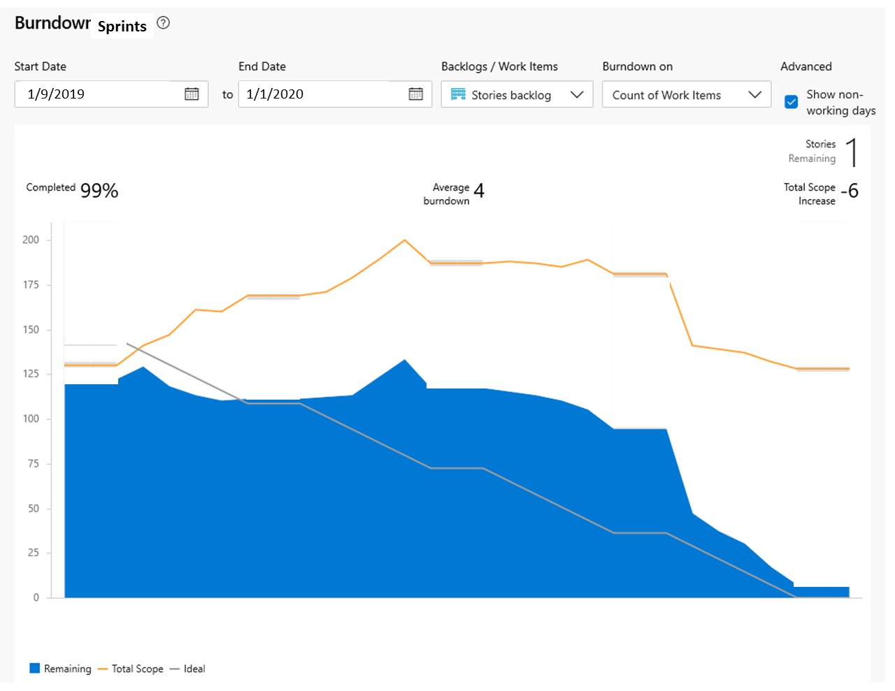
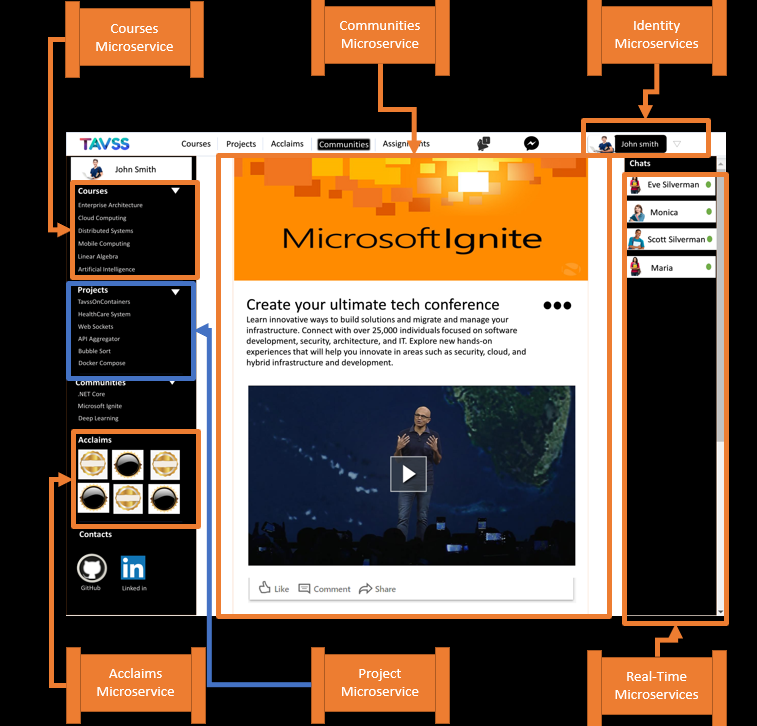

# In The Name of Allah
---

# Results
---

## The Badges of Building of Pipelines and Releasing

|Microservices| Azure Pipelines|Github Workflow|
|:--:|:--:|:---:|
| Identity |||
|Projects|||
|Communities||)|
|Assignments|||
|RealTime|||
|Courses|||
|Acclaims|||
|API Gateways Mobile|||
|API Gateways Web|||

## Consuming Microservices

## © Ahmed Khalil __Mansoura University__ 2019/2020
